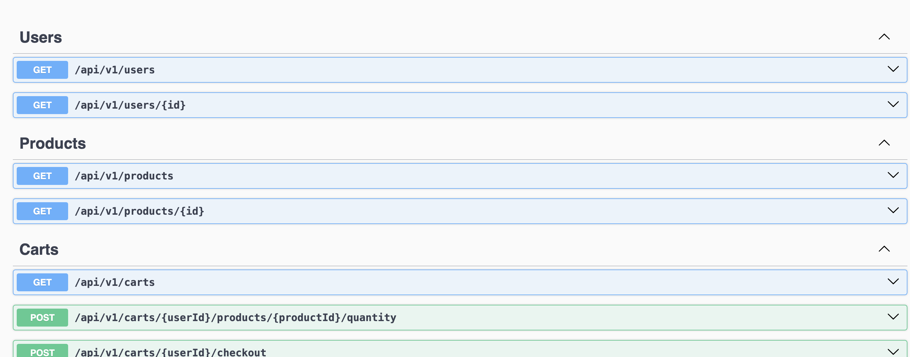
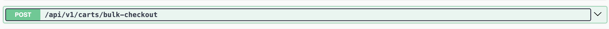

<p align="center">
  <a href="http://nestjs.com/" target="blank"></a>
</p>


<h1 style="text-align: center;" >Breet Assessment</h1>

## Prerequisites
1. Have NodeJs installed on your system
2. Have nest framework installed globally using `npm`
3. Make sure docker is installed on your system


## Project setup
1. Clone the repo on your system
2. Install packages using `$ npm install`
3. Put your MONGODB URI at the route of the project in `.env` imitating `.env.example`
4. Make sure your docker is running, then start redis server by running the `docker-compose.yml` file : `$ docker-compose up`


## Compile and run the project

```bash
# watch mode
$ npm run start:dev
```

 ```bash
  #At the start of the application, mock data for users and product is being saved to the database
```
## API Swagger Documentation
Go to `localhost:3000/api` for documentation
<p align="center">
  <a href="http://nestjs.com/" target="blank"></a>
</p>

### The following endpoint to simulate concurrent users operation for checkout
`http://localhost:3000/api/v1/carts/bulk-checkout`
<p align="center">
  <a href="http://nestjs.com/" target="blank"></a>
</p>

# Assumptions

1. Users are authenticated via JWT tokens: The system presumes that every user has a valid token for identifying themselves.

2. Inventory decrements only on successful checkout: Stock is not reduced when an item is added to the cart, but only when the user completes the purchase.

3. Concurrency conflicts have a simple retry mechanism: For cases where multiple users simultaneously access the inventory, a retry attempt (up to three times) is deemed enough.

4. Read-after-write consistency for cart operations: The system assumes that data will be available immediately after being updated for read operations.

# Scaling Considerations
1. Horizontal Scaling:

    - Stateless API servers can be scaled horizontally

    - Redis cluster for distributed caching

    - MongoDB replica set for read scaling

2. Database Optimization:

    - Sharding for orders collection if order volume is very high

    - Separate read replicas for product catalog queries

3. Further Improvements:

    - Event sourcing for inventory changes

    - Queue-based processing for checkout during peak loads (tool like kafka)

    - Circuit breakers for external service dependencies

# Monitoring Recommendations

1. Track:

    - Inventory update conflicts

    - Checkout success/failure rates

    - Cache hit/miss ratios

    - Database query performance

2. Set alerts for:

    - Low stock levels

    - High checkout failure rates

    - Redis memory usage